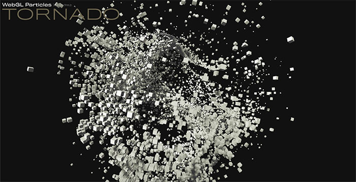

# Tornado

Three.js experiment for with particles using GPU rendering

## Description

This project show how to setup an advanced particle system using [three.js](https://threejs.org/).

It use advanced gpu render technics to increase framerate.

You can control the camera using mouse.

## Youtube video

Check the [video](https://youtu.be/L2obS6Uc9y8) on youtube.